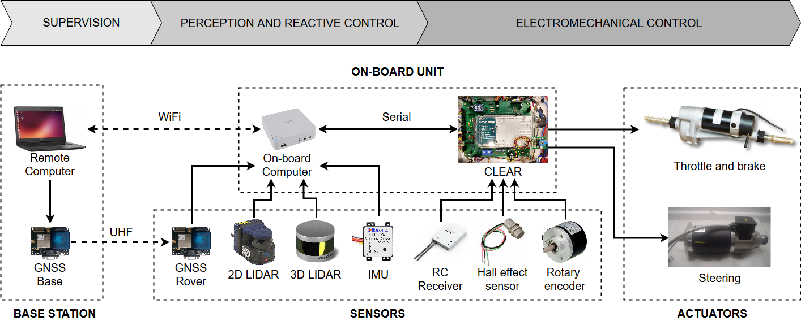

# CLEAR
This repository contains the software and electronic designs developed for the CLEAR (Control Logic for Easy Ackermann Robotization) project.

The aim of this project is to gather in a single module all the common features needed to integrate an Ackermann (or car-like) robot in ROS. It contains a finite state machine that switches between different operational modes, namely, remote control, ROS control, emergency or calibration. Attending to the operational mode, the vehicle will accept commands from the active controller, either ROS or RC. Safety signals will override any command, setting the vehicle in Emergency mode. Within the calibration state, the steering will automatically search for the zero angle using the limit switches and the steering encoder. Besides these operational modes, the CLEAR module sees the hardware through objects of different classes that implement the hardware interface. With this approach we can change any hardware element easily, just changing the descriptor header file that contains the constant values that are hardware dependent, and readjusting the controller gains if needed. Finally the rest of the system, that is, the high level, is seen as a ROS interface, so for the micro-controller is indifferent if the commands are generated autonomously or by a human teleoperator.

The interface between the CLEAR module and the on-board computer is implemented through ROS topics using the _rosserial_ command. These topics are described below: 
  
**desired_verbose_level**  
This topic sets the level of debugging information that is transmitted through the micro-controller serial port.  

**desired_ackermann_state**   
This topic sets the desired values for the low level controllers, using an Ackermann message. This message, as defined by the [Ackermann Interest Group](http://wiki.ros.org/Ackermann%20Group), consists of linear velocity, acceleration and jerk, and steering angle and rate. Indirectly this topic also sets the low level control mode. The expected use of this topic is to set the value that the low level controller must use as reference and reset to zero all the other parameters, if more than one reference is given for the same controller, the greatest derivative will be used, and a warning will be communicated through the correspondent debugging topic.

**measured_ackermann_state**    
This Ackermann message contains the Ackermann values discussed before (linear velocity, acceleration...) measured using the steering encoder and the Hall effect sensor. This information is sent to the high level system that will carry out the sensor fusion task to estimate a much more precise vehicle state using jointly all the available sensors, IMU, GNSS (RTK or standalone) and LIDAR.

**desired_speed_gains**  
This topic enables the on-line adjustment of the low level speed controller.

**desired_steering_gains**  
To dynamically adjust the low level steering controller.

**speed_volts_and_steering_pwm_being_applicated**  
This topic shows the actual outputs that feed the actuators, so it gives the lower level information available to debug the low level controllers.
 
**vehicle_status**  
This topic is composed by four values: the _operational mode_ (emergency, ROS control, remote control and calibration), the _error_ and _warning_ codes and the _verbose level_ selected. Both error and warning codes express any error or warning occurred in any subsystem by setting to one the corresponding bit of the 16 bit integer code.   

In addition, every _desired_ topic produces an _echo_ topic to check communications.  
